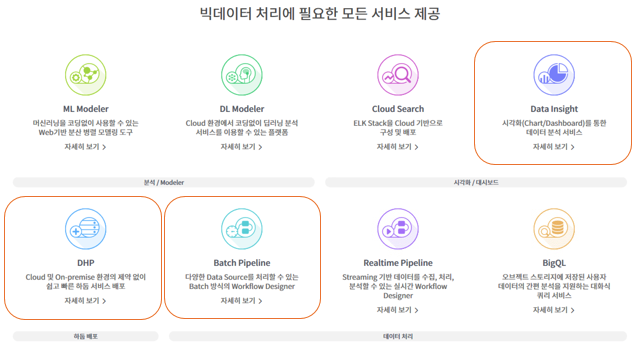
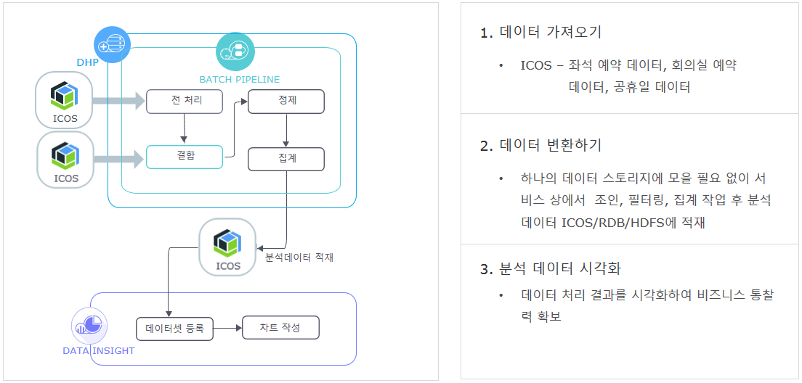
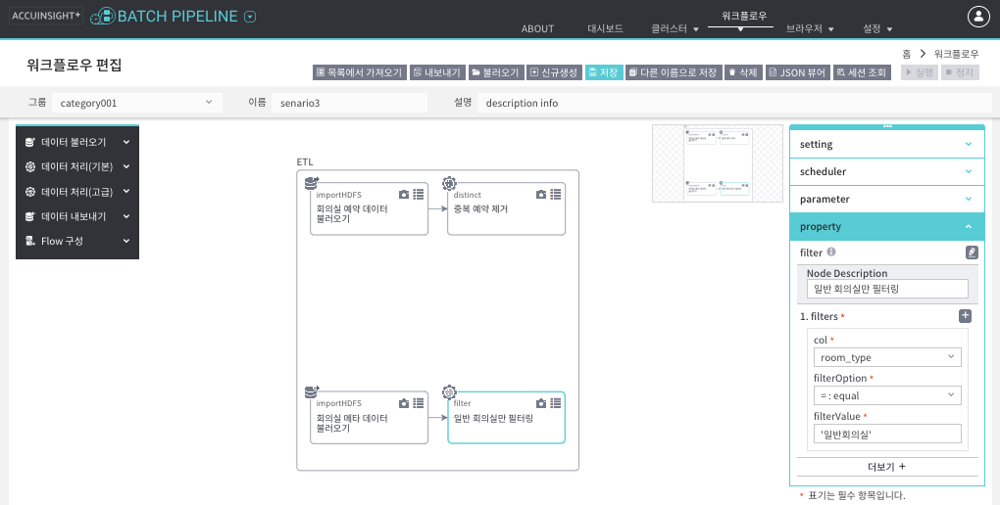
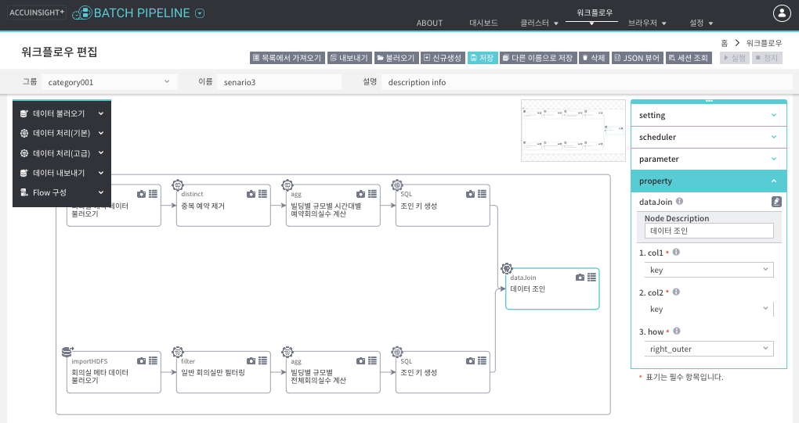
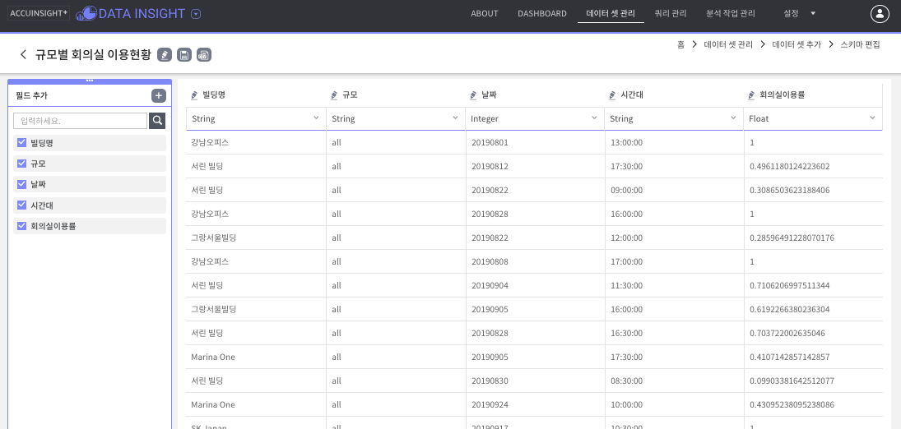
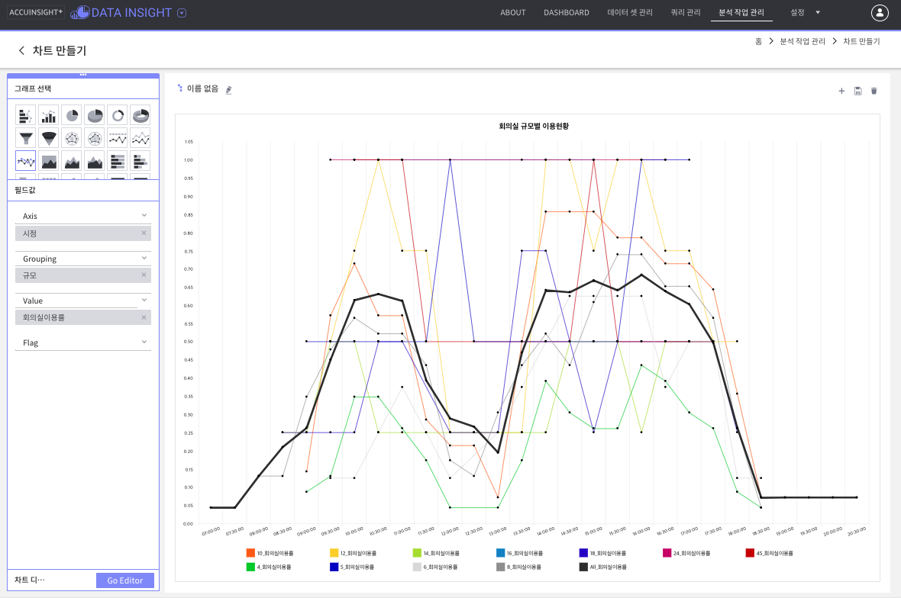

# Demo Instruction
> 공유 오피스 분석 플랫폼 구축 프로젝트에 사용한 AccuInsight+ 서비스 Batch Pipeline, Data Insight를 공유오피스 분석 요건 45개 중 하나를 택해 실습해본다.
  

# AccuInsight+ Services
  

# Demo Outline
  
  

# Scenario : 회의실 규모별 이용현황

## 데이터 준비
ICOS에 업로드된 데이터를 사용합니다.  
스토리지 : IBMOSC1146611-6  
버킷 : handson-bucket  

(1) Dataset 1 : 회의실 예약 데이터

| column명 | column 설명 | Value Example |
|---|:---:|---:|
| `bldg` | 빌딩명 | SKC 본사, 서린 빌딩, ... |
| `room_scale` | 회의실 규모 | 2, 4, 5, ... |
| `room_resv_id` | 각 회의실의 ID | 3a27b3bf-d8de-11e8-975a-0a9726611f46 |
| `time` | 회의실 사용 시점 (30분 단위) | 09:30:00, 11:00:00, ... |
| `dt` | 예약 날짜 | 20190803 |

 
(2) Dataset 2 : 회의실 메타 데이터

| column명 | column 설명 | Value Example |
|---|:---:|---:|
| `bldg` | 빌딩명 | SKC 본사, 서린 빌딩, ... |
| `room_scale` | 회의실 규모 | 2, 4, 5, ... |
| `room_id` | 각 회의실의 ID | 3a27b3bf-d8de-11e8-975a-0a9726611f46 |
| `room_type` | 회의실 유형 | 일반회의실, 프로젝트룸, ... |
| `dt` | 예약 날짜 | 20190803 |
  

## 데이터 처리

### 데이터파일 2개 조인하여 ETL작업 수행하기

ETL flow 구성내용 : ICOS에서 파일 불러오기 → 데이터 정제 → 통계 → join key 생성 → 2개 파일 join → 통계 → 불필요한 column 삭제 → column명 rename → 통계 및 정제를 통한 새로운 파일 생성 → 기존 파일과 통합 → ICOS에 저장    

#### 생성 메뉴로 이동
  

#### 데이터 로딩

데이터 불러오기 그룹에서 ICOS 불러오기 노드를 캔버스 영역에 drag & drop하여 node 생성  
우측 property 패널  
- file : 불러오려는 ICOS 파일의 경로 지정
- option : 데이터에 header가 없는 경우 false로 변경
- schema : 자동 파일 열기  
  
column명 변경  (header)
> 회의실 예약 데이터 : bldg, room_scale, room_resv_id, time, dt  

동일한 방법으로 회의실 메타 데이터도 불러오기  
> 회의실 메타 데이터 : bldg, room_scale, room_id, room_type, dt  
  

#### 데이터 정제

distinct 노드 drag & drop하여 회의실 예약 데이터에서 중복 예약 제거  
filter 노드 drag & drop하여 회의실 메타 데이터에서 일반회의실만 필터링    
우측 property 패널  
- col : room_type
- filterOption : =:equal
- filterValue : ‘일반회의실’  

#### 통계

agg 노드 drag & drop하여 회의실 예약 데이터에서 빌딩별 규모별 시간대별 예약회의실수 계산  
우측 property 패널  
- aggcol : bldg, room_scale, dt, time
- target : func count, col room_resv_id  

agg 노드 drag & drop하여 회의실 메타 데이터에서 빌딩별 규모별 전체회의실수 계산  
우측 property 패널  
- aggcol : bldg, room_scale, dt
- target : func count, col room_id  
  

#### join key 생성

SQL 노드 drag & drop하여 회의실 예약 데이터에서 join key 생성  
우측 property 패널  
- query  
> select bldg,room_scale,dt,time,countroom_resv_id as resv,concat(bldg,'_',room_scale,'_',dt) as key
> from default; 
- overwriteSchema 체크 (SQL 결과로 데이터 변경)  

SQL 노드 drag & drop하여 회의실 메타 데이터에서 join key 생성  
우측 property 패널  
- query  
> select countroom_id as total,concat(bldg,'_',room_scale,'_',dt) as key
> from default;
- overwriteSchema 체크 (SQL 결과로 데이터 변경)  

#### 2개파일 조인

좌측의 데이터 처리하기 클릭  
열린 패널에서 dataJoin 노드 우측 캔버스에 drag & drop하여 생성  
우측 property패널  
- col1 : 회의실 예약 데이터의 key 선택  
- col2 : 회의실 메타 데이터의 key 선택  
- how : right_outer 선택 (col1,col2 순서가 바뀐 경우 left_outer 선택)  

#### 새로운 column 생성

withColumn 노드 drag & drop하여 회의실이용률 계산  
우측 property 패널  
- selectType : column
- col1 : resv_dt_~
- operator : /
- col2 : total_dt_~
- newColumn : ratio  

#### 불필요한 column 삭제

drop 노드 drag & drop하여 불필요한 데이터 삭제  
우측 property 패널  
- 회의실 예약 데이터의 resv_df_~
- 회의실 예약 데이터의 key_df_~
- 회의실 메타 데이터의 total_df_~
- 회의실 메타 데이터의 key_df_~  
  

#### 컬럼명 변경

withColumnRenamed노드 drag&drop하여 생성  
우측 property 패널  
전체  컬럼 불러오기 아이콘을 통해 자동 파싱  
  

#### 통계

agg 노드 drag & drop하여 회의실 전체에 대한 이용률 계산  
우측 property 패널  
- aggcol : bldg, dt, time
- target : func avg, col ratio  
  
#### 새로운 column 생성

withColumn 노드 drag & drop하여 회의실 규모가 ‘전체'인 컬럼 추가  
우측 property 패널  
- selectType : const
- newColumn : room_scale
- constantValue : all
- valueType : String  
  

#### 기존 파일과 통합하기 위해 컬럼 순서 변경

SQL 노드 drag & drop하여 컬럼 순서 변경  
우측 property 패널  
- query  
> select bldg, room_scale, dt, time, avgratio as ratio
> from default;  
- overwriteSchema 체크 (SQL 결과로 데이터 변경)  
  

#### 기존 파일과 통합

unionAll 노드 drag & drop하여 데이터 통합  
  

#### ICOS에 저장

좌측 데이터 내보내기 클릭  
ICOS 내보내기 노드 drag & drop 하여 생성  
withColumnRenamed 노드에서 ICOS 내보내기노드로 연결  
우측 property 패널  
- path의 browse 아이콘을 클릭하여 열리는 팝업에서 저장할 디렉토리 위치 선택 후 확인 클릭 (ex. /tmp)  
- file에 생성할 디렉토리명 입력 (ex.modeling_data)  

#### 저장 및 실행
  
ETL 클릭 후 appName 입력

저장 클릭  
실행 클릭  

#### 워크플로우 상태 확인

 workflow 관리 화면으로 이동하여 상태 확인  
이미 성공으로 종료되었거나 오류가 발생하여 종료된 경우 INACTIVE 상태  
상세정보 컬럼의 Instance목록 아이콘 클릭  

#### 실행결과 확인

CONFIGURATION > ICOS BROWSER 메뉴로 이동  
지정했던 ICOS directory위치로 이동하여 내보내기로 생성한 디렉토리 하단의 part-00000-~파일 클릭  
우측 상단의 다운로드 버튼 클릭하여 파일내용 확인  
  

## 데이터 시각화 (Data Insight) 
### 데이터 준비
#### 데이터 셋 추가
데이터 셋 관리 페이지에서 데이터 셋 추가를 클릭하면 추가 페이지로 이동합니다.  
DataInsight 분석 및 시각화를 위해 MariaDB, ICOS, HIVE 등 다양한 종류의 데이터 셋을 추가할 수 있습니다.  
지원하는 Data Source 타입  
① 로컬 파일 : csv 타입 등 로컬에 있는 파일을 업로드  
② MariaDB : MariaDB 테이블 연동하여 데이터 업로드  
③ AWS RDS: AWS RDS 테이블 연동하여 데이터 업로드  
④ HIVE : 하둡 클러스터의 데이터를 hive를 통하여 업로드  
⑤ ICOS : IBM 오브젝트 스토리지의 파일을 업로드  
⑥ MySQL : MySQL 테이블을 연동하여 데이터 업로드  
  
데이터 셋 추가 : ICOS 선택  
이전에 Batch Pipeline 실행 결과 파일(ICOS) 선택  
스키마 편집  

데이터 셋 이름 변경  
part-00000-~ -> 회사별 일평균 회의실이용률  
column명 변경  
bldg -> 빌딩명, room_scale -> 회의실규모, dt -> 날짜, time -> 시간대, ratio -> 회의실이용률  
저장  

### 차트 작성
#### 분석 작업 관리
분석 작업 관리 페이지에서 분석 작업 생성을 클릭하면 추가 페이지로 이동합니다.  
차트 작성할 데이터 셋 적용  

필터 추가  
- 빌딩명 = 서린 빌딩
- 날짜 = 20190812  
  
분석 작업 차트 생성  
차트 생성 버튼 클릭  
   

 
라인 차트 선택  
Axis : 시점  
Grouping : 회의실규모  
Value : 회의실이용률  
Flag : SUM  
  

  
저장  
차트 생성 버튼 클릭  

### Go Editor

소수점 2째 자리까지 : Number formatting에서 Precision을 2로 변경  
애니메이션 삭제 : Miscellaneous에서 Start duration을 0으로 변경  
Label 위치 변경 : Legend에서 Align 콤보박스 선택  
Label의 Column 개수 증가 : Legend에서 Max columns 개수 지정  
타이틀 설정 : Title에서 Text에 ‘회의실 규모별 이용현황’ 입력  

