> 목차
> ---
> 1. [분석 요건에 대한 정의](scenario_3.md#분석-요건에-대한-정의)
>    1. 실제 공유오피스 분석 화면
> 1. [데이터 준비](scenario_3.md#데이터-준비)
>    1. Dataset 1: 회의실 예약 데이터
>    1. Dataset 2: 회의실 메타 데이터
> 1. [데이터 처리 (Batch Pipeline)](scenario_3.md#데이터-처리-batch-pipeline)
>     1. [데이터파일 2개 조인하여 ETL작업 수행하기](scenario_3.md#데이터파일-2개-조인하여-etl작업-수행하기)
>         1. [생성 메뉴로 이동](scenario_3.md#생성-메뉴로-이동)
>         1. [데이터 로딩](scenario_3.md#데이터-로딩)
>         1. [데이터 정제](scenario_3.md#데이터-정제)
>         1. [통계](scenario_3.md#통계)
>         1. [join key 생성](scenario_3.md#join-key-생성)
>         1. [2개파일 조인](scenario_3.md#2개파일-조인)
>         1. [새로운 column 생성](scenario_3.md#새로운-column-생성)
>         1. [불필요한 column 삭제](scenario_3.md#불필요한-column-삭제)
>         1. [컬럼명 변경](scenario_3.md#컬럼명-변경)
>         1. [통계](scenario_3.md#통계)
>         1. [새로운 column 생성](scenario_3.md#새로운-column-생성)
>         1. [컬럼 순서 변경](scenario_3.md#기존-파일과-통합하기-위해-컬럼-순서-변경)
>         1. [기존 파일과 통합](scenario_3.md#기존-파일과-통합)
>         1. [ICOS에 저장](scenario_3.md#ICOS에-저장)
>     1. [워크플로우 저장 및 실행](scenario_3.md#워크플로우-저장-및-실행)
>     1. [워크플로우 상태 확인](scenario_3.md#워크플로우-상태-확인)
>     1. [실행결과 확인](scenario_3.md#실행결과-확인)
> 1. [데이터 시각화 (Data Insight)](scenario_3.md#데이터-시각화-data-insight)
>     1. [데이터 셋 준비](scenario_3.md#데이터-셋-준비)
>         1. [데이터 셋 추가](scenario_3.md#데이터-셋-추가)
>     1. [차트 작성](scenario_3.md#차트-작성)
>         1. [데이터 셋 선택](scenario_3.md#데이터-셋-선택)
>         1. [필터 설정](scenario_3.md#필터-설정)
>         1. [라인 차트 작성](scenario_3.md#라인-차트-작성)
>     1. [Go Editor](scenario_3.md#go-editor)

<br/><br/>

# 분석 요건에 대한 정의

> 약 25개의 SK 관계사들의 건물별 규모별 시간대별 회의실 이용 현황을 분석한다.

<br/>

# 실제 공유오피스 분석 화면

- 회의실 규모별 이용현황

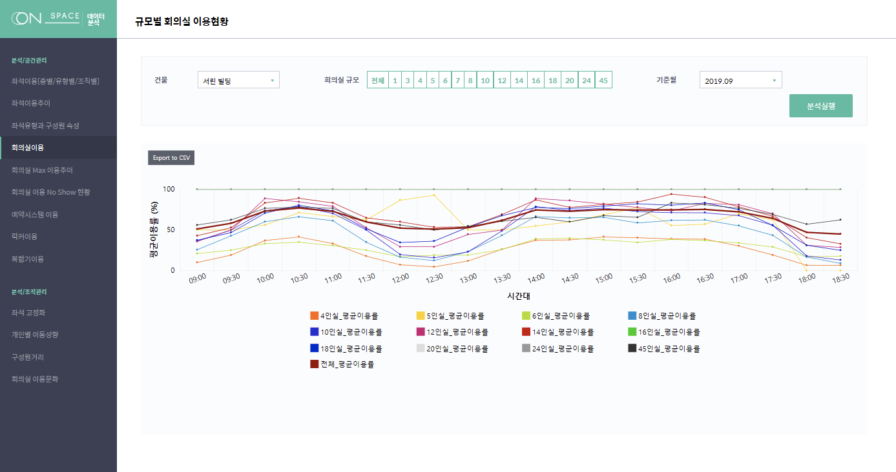

<br/>

## 데이터 준비
> ICOS에 업로드된 데이터를 사용합니다.  
> 스토리지 : IBMOSC1146611-6  
> 버킷 : handson-bucket

<br/>

(1) Dataset 1 : 회의실 예약 데이터

| column명 | column 설명 | Value Example |
|---|:---:|---:|
| `bldg` | 건물명 | SKC 본사, 서린 빌딩, ... |
| `room_scale` | 회의실 규모 | 2, 4, 5, ... |
| `room_resv_id` | 각 회의실의 ID | 3a27b3bf-d8de-11e8-975a-0a9726611f46 |
| `time` | 회의실 사용 시점 (30분 단위) | 09:30:00, 11:00:00, ... |
| `dt` | 예약 날짜 | 20190803 |

<br/>

(2) Dataset 2 : 회의실 메타 데이터

| column명 | column 설명 | Value Example |
|---|:---:|---:|
| `bldg` | 건물명 | SKC 본사, 서린 빌딩, ... |
| `room_scale` | 회의실 규모 | 2, 4, 5, ... |
| `room_id` | 각 회의실의 ID | 3a27b3bf-d8de-11e8-975a-0a9726611f46 |
| `room_type` | 회의실 유형 | 일반회의실, 프로젝트룸, ... |
| `dt` | 예약 날짜 | 20190803 |

<br/>

## 데이터 처리

<br/>

### 데이터파일 2개 조인하여 ETL작업 수행하기

<br/>

> ETL flow 구성내용 : `ICOS에서 파일 불러오기` → `데이터 정제` → `통계` → `join key 생성` → `2개 파일 join` → `통계` → `불필요한 column 삭제` → `column명 rename` → `통계 및 정제를 통한 새로운 파일 생성` → `기존 파일과 통합` → `ICOS에 저장`  

<br/>

#### 생성 메뉴로 이동


<br/>

#### 데이터 로딩

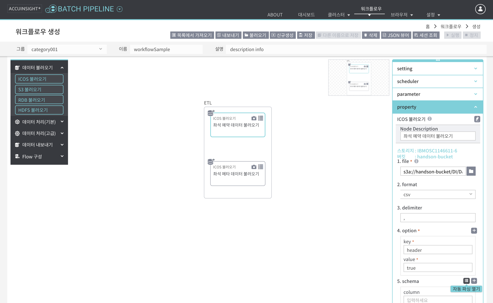

<br/>

`데이터 ` 패널에서 `ICOS 불러오기` 노드를 캔버스 영역에 drag & drop하여 node 생성  
우측 property 패널  
- **file** : 불러오려는 ICOS 파일의 경로 지정
    - 회의실 예약 데이터의 경로 : IBMOSC1146611-6 스토리지에서 handson-bucket/DI/Dataset/room_resv
    - 회의실 메타 데이터의 경로 : IBMOSC1146611-6 스토리지에서 handson-bucket/DI/Dataset/room_info
- **option** : 데이터에 header가 없는 경우 false로 변경
- **schema** : `자동 파싱 열기` 클릭   

<br/>

    파싱을 처음 수행하는 경우, [세션 생성] 팝업이 뜸 ex) 지금 [1st2063] 클러스터에 세션을 생성하시겠습니까?
    [예] 클릭
    [취소] 클릭해서 자동 파싱 창을 나갔다가 다시 [자동 파싱 열기] 클릭

<br/>

schema - `자동 파싱 열기` - sample data 탭에서 데이터 샘플을 확인<br/>
schema - `자동 파싱 열기` - column info 탭에서 컬럼명 변경<br/>

<br/>

    column info 탭에서 컬럼 인식이 안된 경우, 전체파싱 [+] 클릭

> 회의실 예약 데이터 : bldg, room_scale, room_resv_id, time, dt  

`확인` 클릭 

     Note : 우측 property 패널 - schema 에서 직접 컬럼명 변경 가능

<br/>

동일한 방법으로 회의실 메타 데이터도 불러오기  
> 회의실 메타 데이터 : bldg, room_scale, room_id, room_type, dt  

<br/>

#### 데이터 정제


`데이터 처리(기본)` 패널에서 `distinct` 노드 drag & drop하여 회의실 예약 데이터에서 중복 예약 제거<br/>
회의실 예약 데이터에서 `distinct` 노드로 연결<br/><br/>
`데이터 처리(기본)` 패널에서 `filter` 노드 drag & drop하여 회의실 메타 데이터에서 일반회의실만 필터링<br/>
회의실 메타 데이터에서 `filter` 노드로 연결<br/><br/>
우측 property 패널<br/>
- **col** : room_type
- **filterOption** : =:equal
- **filterValue** : ‘일반회의실’  

<br/>

#### 통계

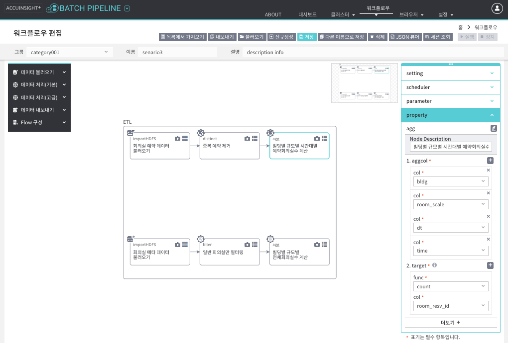

`데이터 처리(기본)` 패널에서 `agg` 노드 drag & drop하여 회의실 예약 데이터에서 건물별 규모별 시간대별 예약회의실수 계산<br/>
`distinct` 노드에서 `agg` 노드로 연결<br/>
우측 property 패널<br/>
- **aggcol** : bldg, room_scale, dt, time  (aggcol 우측 [+] 로 컬럼 추가)<br/>
- **target** : func count, col room_resv_id<br/>

<br/>

`데이터 처리(기본)` 패널에서 `agg` 노드 drag & drop하여 회의실 메타 데이터에서 건물별 규모별 전체회의실수 계산<br/>
`filter` 노드에서 `agg` 노드로 연결<br/>
우측 property 패널<br/>
- **aggcol** : bldg, room_scale, dt<br/>
- **target** : func count, col room_id<br/>

<br/>

#### join key 생성

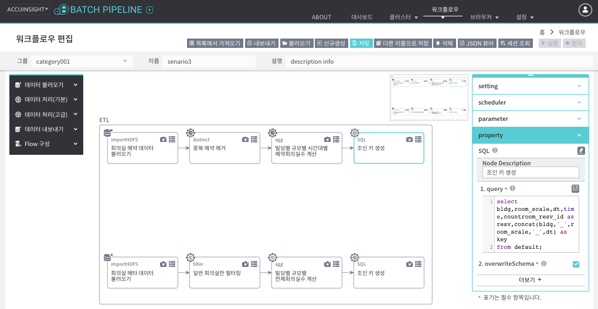

`데이터 처리(고급)` 패널에서 `SQL` 노드 drag & drop하여 회의실 예약 데이터에서 join key 생성<br/>
회의실 예약 데이터의 `agg` 노드에서 `SQL` 노드로 연결<br/>
우측 property 패널<br/>
- **query**  

```SQL
select bldg,room_scale,dt,time,countroom_resv_id as resv,concat(bldg,'_',room_scale,'_',dt) as key
from default;
```

- **overwriteSchema** 체크 (SQL 결과로 변경된 데이터 적용)  

<br/>

`데이터 처리(고급)` 패널에서 `SQL` 노드 drag & drop하여 회의실 메타 데이터에서 join key 생성<br/>
회의실 메타 데이터의 `agg` 노드에서 `SQL` 노드로 연결<br/>
우측 property 패널  
- **query**  

```SQL  
select countroom_id as total,concat(bldg,'_',room_scale,'_',dt) as key
from default;
```

- **overwriteSchema** 체크 (SQL 결과로 데이터 변경)  

<br/>

#### 2개파일 조인


좌측의 `데이터 처리(기본)` 패널에서 `dataJoin` 노드 우측 캔버스에 drag & drop하여 생성  
`SQL` 노드 두개를 `dataJoin` 노드로 연결<br/> 
우측 property패널<br/> 
- **col1** : 회의실 예약 데이터의 key 선택  
- **col2** : 회의실 메타 데이터의 key 선택  
- **how** : left_outer 선택 (col1,col2 순서가 바뀐 경우 right_outer 선택)  

<br/>

#### 새로운 column 생성

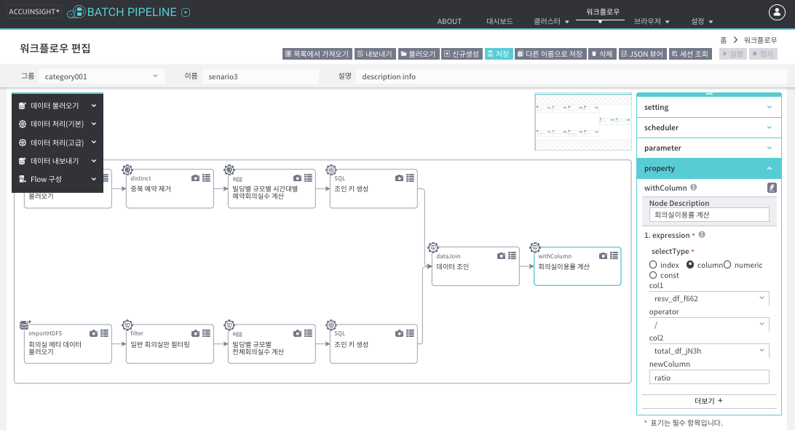

`데이터 처리(기본)` 패널에서 `withColumn` 노드 drag & drop하여 회의실이용률 계산  
`dataJoin` 노드에서 `withColumn` 노드로 연결<br/>
우측 property 패널  
- **selectType** : column
- **col1** : resv_dt_~
- **operator** : /
- **col2** : total_dt_~
- **newColumn** : ratio  

<br/>

#### 불필요한 column 삭제

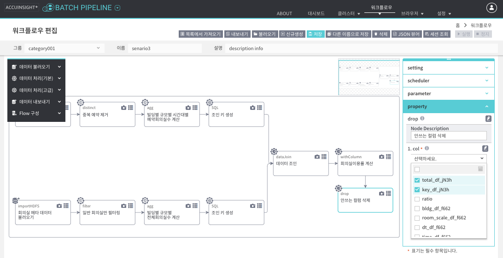

`데이터 처리(기본)` 패널에서 `drop` 노드 drag & drop하여 불필요한 데이터 삭제  
`withColumn` 노드에서 `drop` 노드로 연결<br/>
우측 property 패널  
- **col** checkbox에서 아래 4가지 column 체크
    - 회의실 예약 데이터의 resv_df_~
    - 회의실 예약 데이터의 key_df_~
    - 회의실 메타 데이터의 total_df_~
    - 회의실 메타 데이터의 key_df_~  

<br/>

#### 컬럼명 변경

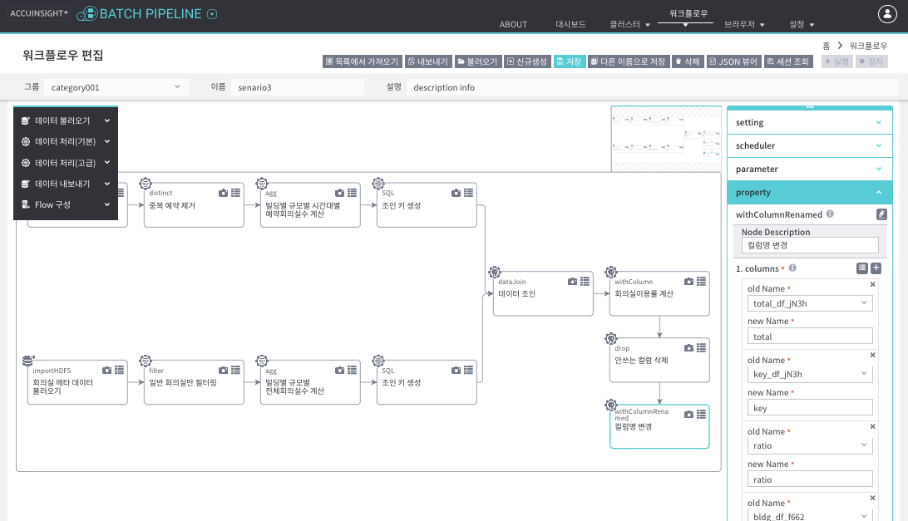

`데이터 처리(기본)` 패널에서 `withColumnRenamed` 노드 drag&drop하여 생성<br/>
`drop` 노드에서 `withColumnRenamed` 노드로 연결<br/>
우측 property 패널<br/>
- `전체 컬럼 불러오기` 아이콘을 통해 자동 파싱<br/>

<br/>

#### 통계

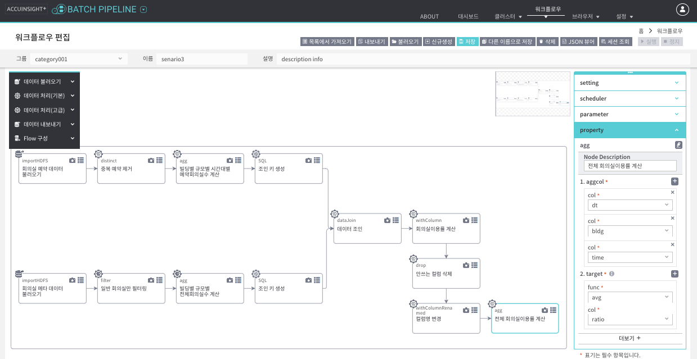

`데이터 처리(기본)` 패널에서 `agg` 노드 drag & drop하여 회의실 전체에 대한 이용률 계산<br/>
`withColumnRenamed` 노드에서 `agg` 노드로 연결<br/>
우측 property 패널<br/>
- **aggcol** : bldg, dt, time
- **target** : func avg, col ratio  

<br/>

#### 새로운 column 생성


`데이터 처리(기본)` 패널에서 `withColumn` 노드 drag & drop하여 회의실 규모가 ‘전체'인 컬럼 추가<br/>
`agg` 노드에서 `withColumn` 노드로 연결<br/>
우측 property 패널<br/>
- **selectType** : const
- **newColumn** : room_scale
- **constantValue** : all
- **valueType** : String  
  
<br/>

#### 기존 파일과 통합하기 위해 컬럼 순서 변경

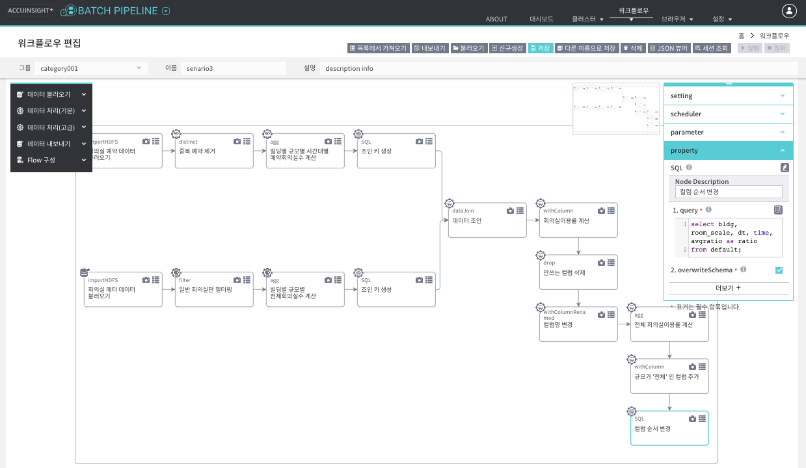

`데이터 처리(고급)` 패널에서 `SQL` 노드 drag & drop하여 컬럼 순서 변경<br/>
`withColumn` 노드에서 `SQL` 노드로 연결<br/>
우측 property 패널<br/>
- **query**

```SQL
select bldg, room_scale, dt, time, avgratio as ratio
from default;  
```

- **overwriteSchema** 체크 (SQL 결과로 변경된 데이터 적용)  

<br/>

#### 기존 파일과 통합

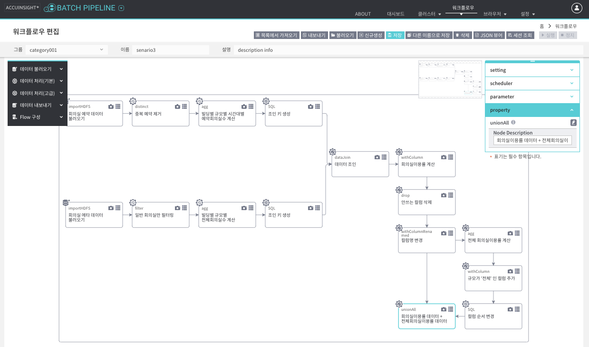

`데이터 처리(기본)` 패널에서 `unionAll` 노드 drag & drop하여 데이터 통합<br/>
`withColumnRenamed` 노드와 `SQL` 노드를 `unionAll` 노드에 연결<br/>

<br/>

#### ICOS에 저장

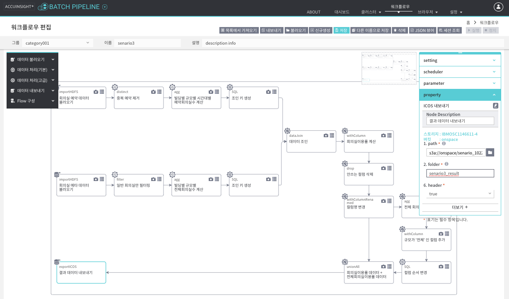

좌측 `데이터 내보내기` 패널에서 `ICOS 내보내기` 노드 drag & drop 하여 생성<br/>
`unionAll` 노드에서 `ICOS 내보내기` 노드로 연결<br/>

<br/>

우측 property 패널<br/>
- **path**의 browse 아이콘을 클릭하여 열리는 팝업에서 저장할 디렉토리 위치 선택 후 확인 클릭 (ex. ~/DI/results)  
- **folder**에 생성할 디렉토리명 입력 (ex. edu01_scenario2)  

<br/>

### 워크플로우 저장 및 실행
  
ETL 클릭 후 appName 입력


저장 클릭<br/>
실행 클릭<br/>

<br/>

### 워크플로우 상태 확인


`워크플로우 관리` 화면으로 이동하여 상태 확인<br/>
이미 성공으로 종료되었거나 오류가 발생하여 종료된 경우 INACTIVE 상태<br/>
상세정보 컬럼의 `인스턴스 목록` 아이콘 클릭하면 이전 실행 이력 관리 가능<br/>

<br/>

### 실행결과 확인


`브라우저` 탭 > `ICOS` 메뉴로 이동<br/>
지정했던 ICOS directory 위치로 이동하여 내보내기로 생성한 디렉토리 하단의 part-00000-~파일 클릭<br/>
우측 상단의 `다운로드` 버튼 클릭하여 파일내용 확인<br/>

<br/><br/>

## 데이터 시각화 (Data Insight) 

<br/>

### 데이터 준비

<br/>

#### 데이터 셋 추가
`데이터 셋 관리` 페이지에서 `데이터 셋 추가`를 클릭하면 추가 페이지로 이동합니다.<br/>

<br/>


<br/>

DataInsight 분석 및 시각화를 위해 MariaDB, ICOS, HIVE 등 다양한 종류의 데이터 셋을 추가할 수 있습니다.<br/>
지원하는 Data Source 타입<br/>
① 로컬 파일 : csv 타입 등 로컬에 있는 파일을 업로드<br/>
② MariaDB : MariaDB 테이블 연동하여 데이터 업로드<br/>
③ AWS RDS: AWS RDS 테이블 연동하여 데이터 업로드<br/>
④ HIVE : 하둡 클러스터의 데이터를 hive를 통하여 업로드<br/>
⑤ ICOS : IBM 오브젝트 스토리지의 파일을 업로드<br/>
⑥ MySQL : MySQL 테이블을 연동하여 데이터 업로드<br/>

<br/>

> 위에서 Batch Pipeline을 통해 실행한 결과 파일을 사용합니다.<br/>
> 스토리지 : IBMOSC1146611-6<br/>
> 버킷 : handson-bucket<br/>

`데이터 셋 추가` 클릭 후 `ICOS` 선택<br/>
1단계_ICOS선택<br/>
2단계_Bucket선택<br/>
`스키마 편집` 클릭<br/>

<br/>

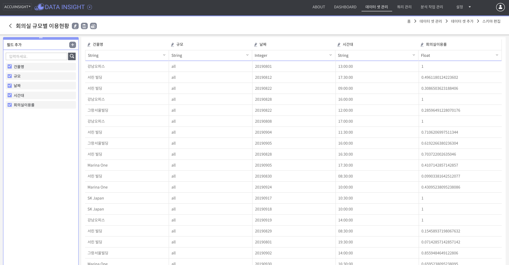

`수정` 클릭하여 그룹 설정 및 데이터 셋 이름 변경<br/>
- part-00000-~ -> 회의실 규모별 이용현황<br/>


각 컬럼의 `필드명 변경`을 통해 컬럼명 변경<br/> 
- **bldg** -> 건물명<br/>
- **room_scale** -> 규모<br/>
- **dt** -> 날짜<br/>
- **time** -> 시간대<br/>
- **ratio** -> 회의실이용률<br/>

`저장` 클릭<br/>
_새로운 분석 작업 페이지로 이동 하겠습니까?_ 라는 팝업이 뜨면 `이동`하거나 `아니요`하고 다음 단계<br/>

<br/>

### 차트 작성

<br/>

#### 데이터 셋 선택
`분석 작업 관리` 페이지에서 `분석 작업 생성`을 클릭하면 추가 페이지로 이동합니다.<br/>
차트 작성할 데이터 셋 `적용` 아이콘 <br/>


<br/>

`분석 작업 생성` 팝업이 뜨면 **그룹** 지정 및 **분석 작업 제목** 입력<br/>
`저장` 클릭<br/>

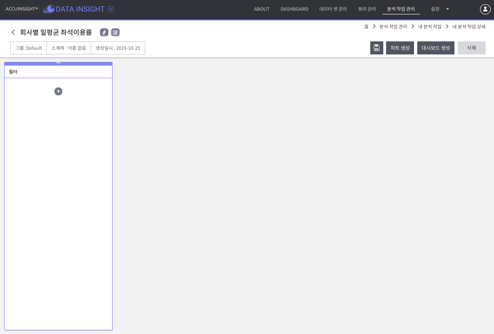

<br/>

#### 필터 설정

좌측 `필터` 목록에서 `(+)` 버튼으로 필터 추가<br/>
필터의 **이름** 입력<br/>

- 이름 없음 -> 건물


해당 필터의 `수정` 아이콘 클릭<br/>
필터 이름 오른쪽에 위치한 `[+]` 버튼으로 필터 조건 입력<br/>


- 첫번째 콤보박스에서 **건물명** 선택
- 두번째 콤보박스에서 **=** 선택
- 세번째 박스에 **서린 빌딩** 입력
<br/>

    Note : 필터 왼쪽 체크박스를 통해 각 필터의 적용/미적용에 따른 차트 변화를 실시간으로 확인 가능

<br/>

필터 이름 왼쪽에 위치한 `<` 버튼 클릭 <br/>

<br/>

좌측 `필터` 목록에서 `(+)` 버튼으로 필터 추가<br/>
필터의 **이름** 입력<br/>

- 이름 없음 -> 날짜


해당 필터의 `수정` 아이콘 클릭<br/>
필터 이름 오른쪽에 위치한 `[+]` 버튼으로 필터 조건 입력<br/>


- 첫번째 콤보박스에서 **날짜** 선택
- 두번째 콤보박스에서 **=** 선택
- 세번째 박스에 **20190812** 입력
<br/>

필터 이름 왼쪽에 위치한 `<` 버튼 클릭 <br/>

<br/>

#### 라인 차트 작성

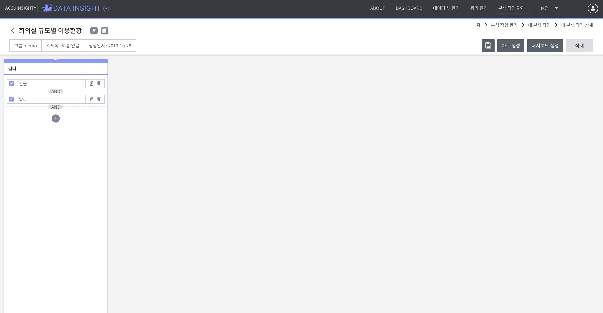
 
`차트 생성` 버튼 클릭<br/><br/>
 
좌측 `그래프 선택` 목록에서 `라인 차트` 선택<br/>
`필드값` 입력<br/>

- **Axis** 콤보박스에서 **시간대** 선택<br/>
- **Grouping** 콤보박스에서 **규모** 선택<br/>
- **Value** 콤보박스에서 **회의실이용률** 선택<br/>
- **Flag** 콤보박스에서 **SUM** 선택<br/>
<br/>

    Note : Flag를 선택하지 않으면, Value값이 Integer나 Float면 SUM, String인 경우 COUNT하도록 설정되어 있다

<br/>
  
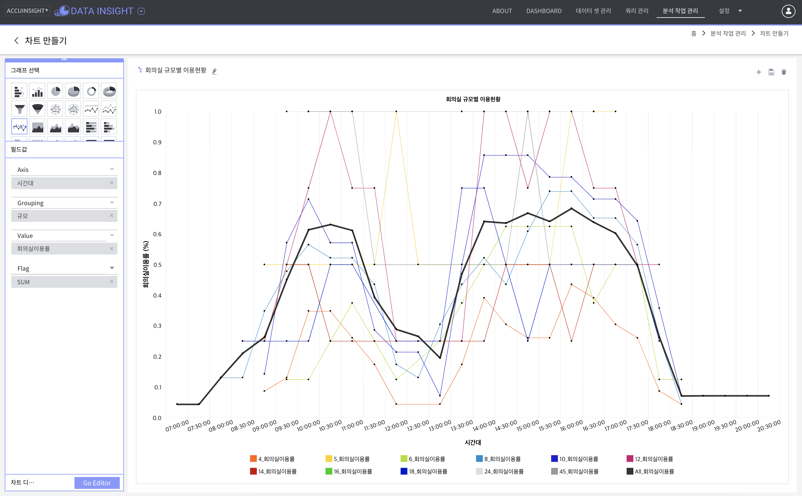
  
`저장` 클릭<br/>

<br/>  

### Go Editor

에디터를 통해 분석 차트의 외관 수정이 가능합니다.<br/>
차트 색, 배경 색, 투명도 등을 변경하여 차트를 보기 좋게 디자인 할 수 있습니다.<br/>

<br/>

    소수점 2째 자리까지 : Number formatting에서 Precision을 2로 변경  
    애니메이션 삭제 : Miscellaneous에서 Start duration을 0으로 변경  
    Label 위치 변경 : Legend에서 Align 콤보박스 선택  
    Label의 Column 개수 증가 : Legend에서 Max columns 개수 지정  
    타이틀 설정 : Title에서 Text에 ‘회의실 규모별 이용현황’ 입력  

<br/>
