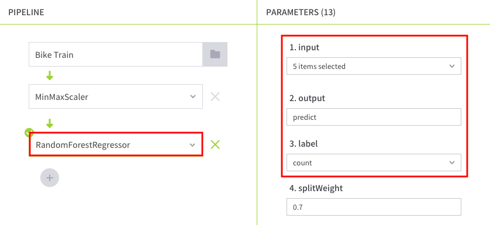
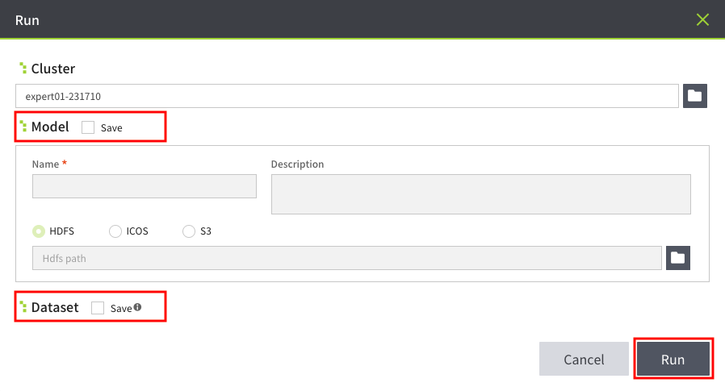
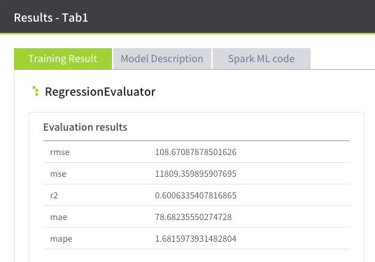

# 모델 2

## 차례

1. [데이터셋 추가](README.md)
1. [모델 1 생성](1.model.md)
1. **모델 2 생성**
   1. 데이터셋 추가
   1. Min Max Scaler
   1. Random Forest Regressor
   1. 파이프라인 실행
   1. 결과 확인
1. [모델 3 생성 및 저장](3.model.md)
1. [모델 테스트](4.test.md)

---

## 알고리즘 제거

이전에 사용한 회귀 알고리즘을 제거한다.

## 알고리즘 추가

알고리즘 목록에서 **Min Max Scaler**를 선택한다. 

1. input: 
   - `temp`
   - `atemp`
1. output: `scaled`
1. min: `0.0`
1. max: `1.0`

## Regressor 선택

알고리즘 목록에서 **Random Forest Regressor**를 선택한다. 

1. input
   - `year`
   - `month`
   - `day`
   - `hour`
   - **`scaled`**: 추가
1. output: `predict`
1. label: `count`

## Run

파이프라인 실행을 위해 `우측 상단 → Run` 버튼을 클릭한다.  
모델 실행 결과만 확인하기 위해 모델과 데이터셋은 생성하지 않고  파이프라인을 실행한다.

1. Cluster: 선택
1. Model, Dataset: Save 체크박스 해제
1. Run 버튼 클릭

## 실행 결과 확인

실행이 완료 되면 `우측 상단 → Show results` 버튼을 클릭힌다.

### Training Result

**Regression Evaluator**

| Evaluation | Result |
|---|---|
| RSME | 108.67087878501626 |
| MSE | 11809.359895907695 |
| R2 | 0.6006335407816865 |
| MAE | 78.68235550274728 |
| MAPE | 1.6815973931482804 |

### Model Description

---

다음: [모델 3 생성 및 저장](3.model.md)