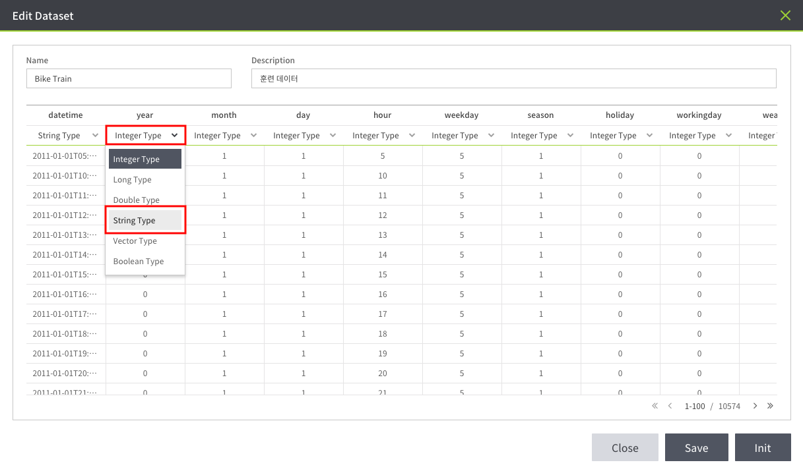
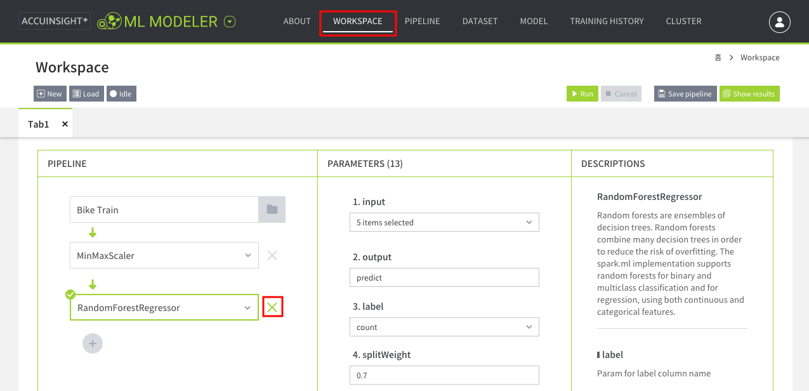
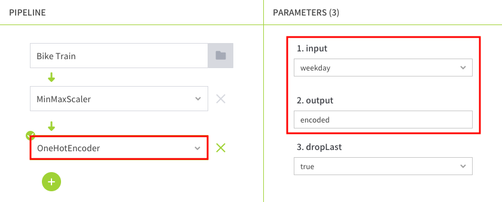
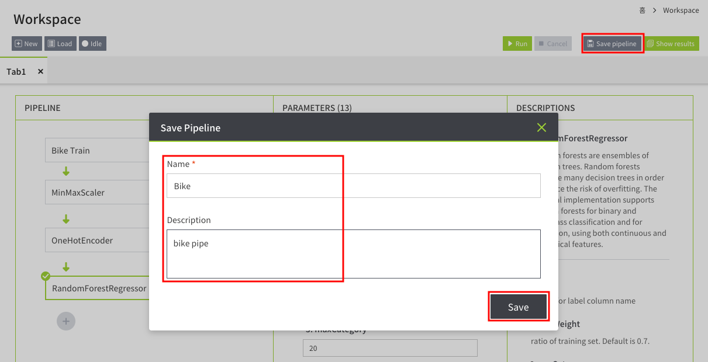
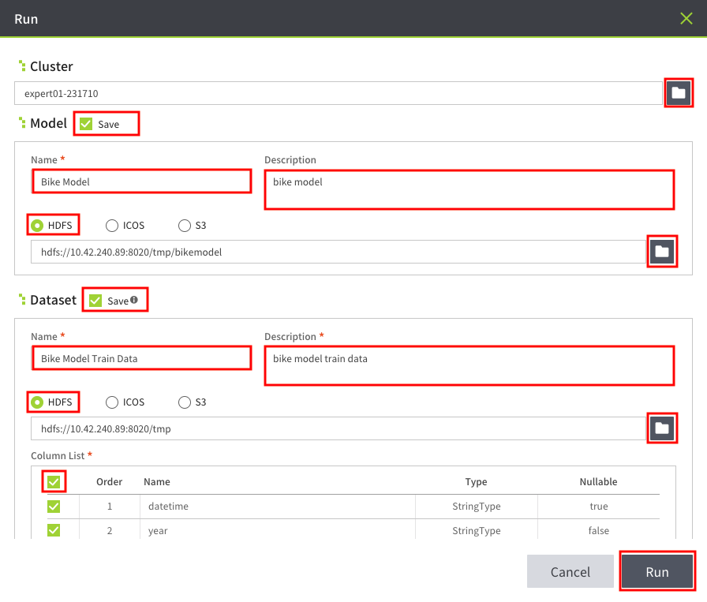
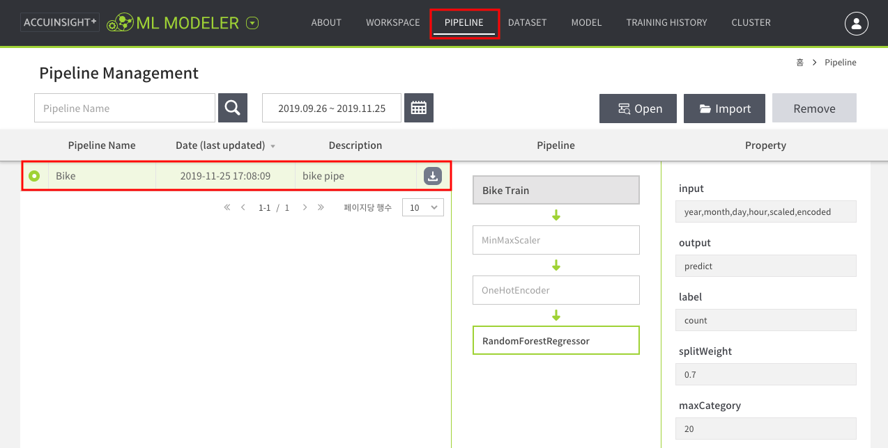

# 모델 3

## 차례

1. [데이터셋 추가](README.md)
1. [모델 1 생성](1.model.md)
1. [모델 2 생성](2.model.md)
1. **모델 3 생성 및 저장**
   1. 데이터셋 수정
   1. 데이터셋 추가
   1. Min Max Scaler
   1. One Hot Encoder
   1. Random Forest Regressor
   1. 파이프라인 저장
   1. 모델 저장
   1. 파이프라인 실행
   1. 결과 확인
1. [모델 테스트](4.test.md)

---

## 데이터셋 수정

One Hot Encoder를 사용하기 전, 데이터의 자료 형식을 수정해야한다.

1. `상단 메뉴 → DATASET`
1. 수정 버튼 클릭

### 형식 변경

몇가지 컬럼들을 정수형에서 문자열로 바꿔준다.

1. 컬럼 형식 변경: `Integer Type` → `String Type`
   - year
   - month
   - day
   - hour
   - weekday
   - season
   - holiday
   - workingday
   - weather
1. Save 버튼 클릭

## 알고리즘 제거

다시 워크스페이스로 돌아가서 이전에 사용한 회귀 알고리즘을 제거한다.

1. `상단 메뉴 → WORKSPACE`
1. Random Forest Regressor 제거

## 알고리즘 선택

알고리즘 목록에서 **One Hot Encoder**를 선택한다. 

1. input: `weekday`
1. output: `encoded`
1. dropLast: `true`

## Regressor 선택

알고리즘 목록에서 **Random Forest Regressor**를 선택한다. 

1. input
   - `year`
   - `month`
   - `day`
   - `hour`
   - `scaled`
   - **`encoded`**: 추가
1. output: `predict`
1. label: `count`

## 파이프라인 저장

1. 파이프라인 저장을 위해 `우측 상단 → Save pipeline` 버튼을 클릭한다.  
1. 파이프라인 정보를 입력한다.
   - Name: `Bike`
   - Description: `bike pipe`
1. Save 버튼을 클릭해 저장한다.

## Run

파이프라인 실행을 위해 `우측 상단 → Run` 버튼을 클릭한다. 

1. Cluster: 선택
1. Model: Save 체크
   - Name: `Bike Model`
   - Description: `bike model`
   - HDFS 경로 선택: `/tmp/bikemodel`
1. Dataset: Save 체크박스 해제
1. Run 버튼 클릭

### Model 저장 경로

새 폴더를 만들어서 모델 저장 경로를 선택한다.

## 실행 결과 확인

Show results 버튼 클릭

### Training Result

**Regression Evaluator**

| Evaluation | Result |
|---|---|
| RSME | 92.77540130251586 |
| MSE | 8607.275086842861 |
| R2 | 0.7089209741044797 |
| MAE | 66.00612898381644 |
| MAPE | 1.4832416305525595 |

### Model Description

---

## 파이프라인 확인

`상단 메뉴 → PIPELINE`에서 저장한 파이프라인을 확인한다.

---

## 훈련 기록 확인

`상단 메뉴 → TRAINING HISTORY`에서 현재까지 실행한 훈련 기록들을 확인한다.

---

다음: [모델 테스트](4.test.md)